# AI-GM Standalone

> AI 驱动的视觉小说 RPG 桌面应用 —— 让 AI 成为你的游戏主持人 🎲🤖

[](https://github.com/kings9527/ai-gm-standalone/releases) [](#安装) [](LICENSE.txt)

---

## 📖 简介

**AI-GM Standalone** 是一款基于 Electron 的桌面应用，将 AI 大语言模型（LLM）与视觉小说引擎相结合，让你能够：

- 📝 **写故事** → 粘贴文本，AI 自动生成可游玩的模组
- 🎨 **分析风格** → AI 提取故事的视觉风格，生成主题配置
- 🎮 **玩游戏** → 沉浸式的视觉小说体验，支持回合制战斗
- 🖼️ **生成图片** → AI 自动生成场景背景和角色立绘
- 🤝 **分享模组** → 导入/导出 JSON 格式模组，与朋友分享

无论是克苏鲁跑团（COC）、龙与地下城（D&D），还是自定义规则系统，AI-GM 都能帮你快速构建和运行桌面 RPG 体验。

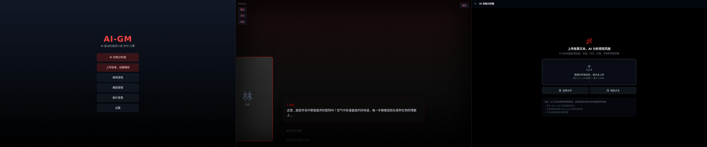

---

## ✨ 功能列表

### Phase 1 — 基础框架（VN 引擎 / 存档 / 设置）

- **视觉小说引擎** — 分层渲染系统（背景层 + 立绘层 + 对话层 + 特效层 + 选项层），支持打字机动画、场景过渡、实时视觉特效
- **场景系统** — 场景切换、出口导航、隐藏线索发现、氛围管理
- **存档/读档系统** — 多槽位手动存档（支持自定义名称和缩略图截图）、自动存档（场景切换/战斗开始/关键事件）
- **设置系统** — LLM 配置、图像配置、游戏设置（打字机速度/字体大小/自动推进）、主题切换（深色/浅色/自动）
- **桌面集成** — 中文菜单栏、全屏模式（F11）、开发者工具（F12）

### Phase 2 — AI 集成（模组生成 / 风格分析 / 图片生成）

- **多 LLM 支持** — OpenAI (GPT-4o / GPT-4o-mini)、Claude (3.5 Sonnet)、Ollama 本地模型，通过安全后端 IPC 代理
- **流式对话** — SSE 格式实时流式响应，逐字显示 AI 回复
- **AI 模组生成器** — 粘贴故事文本（≥200 字），AI 自动分析并生成完整可玩模组（场景/NPC/物品/事件/战斗）
- **AI 风格分析器** — 提取故事的视觉风格配置：色板、氛围、艺术风格、光照、情绪关键词
- **AI 图片生成** — DALL-E 3 集成，自动生成背景图（1792×1024）和角色立绘（1024×1792）
- **图片资源管理** — Unsplash API 搜索（Picsum Photos 兜底）、本地上传（JPG/PNG/GIF/WebP/BMP）、分类存储

### Phase 3 — 核心玩法（战斗 / NPC / 任务 / 世界动态）

- **回合制战斗系统** — COC 风格 d100 检定（大成功 ≤5 / 大失败 ≥96），支持攻击、技能、物品、防御、逃跑、等待六种行动
- **技能库** — 8 个内置技能（斗殴、枪械、闪避、急救、鼓舞、瞄准、拼命一击、恐吓），支持状态效果（增益/减益）
- **AI 敌人行为** — 优先锁定最低血量目标，30% 概率随机使用技能
- **NPC 系统** — NPC 状态管理、好感度/信任度追踪、动态对话生成
- **NPC 决策引擎** — 基于场景上下文和 NPC 性格的自主决策，支持情绪状态影响行为
- **任务系统** — 主/支线任务追踪、任务目标与完成条件、任务日志
- **世界动态响应** — 世界状态管理、 faction 关系变化、场景事件触发、全局变量系统
- **规则引擎** — COC、d100、D&D 5e 和自定义规则系统支持

### Phase 4 — 智能交互（意图解析 / 自由输入 / 状态机）

- **自由输入系统** — 玩家可输入任意自然语言指令，不再局限于预设选项
- **意图解析引擎** — NLP 解析玩家输入，识别行动类型（移动/调查/交谈/战斗/使用物品/感知等）
- **AI-GM 叙事生成** — 基于当前场景状态、NPC 位置、世界动态，实时生成叙事回应
- **游戏状态机** — 不可变状态管理（Zustand），场景流控制、事件触发、条件判断、分支对话
- **情绪引擎** — 角色情绪状态追踪，影响对话内容和 NPC 反应
- **探索系统** — 调查环境、发现隐藏线索、场景交互

### 💾 数据管理

- 本地 SQLite 数据库（better-sqlite3），无需联网即可游玩
- 模组导入/导出（JSON 格式）
- 风格模板保存与复用
- 完整战役状态保存（玩家属性、背包、场景历史、NPC 状态、VN 引擎快照）

### 🖥️ 桌面集成

- Windows / macOS / Linux 三平台支持
- 自动更新（GitHub Releases）
- 安全 IPC 通信（API Key 永不暴露给前端，AES-256-GCM + PBKDF2 加密存储）
- 应用内菜单（暂停、存档、设置、退出）
- 战斗快捷键（1-4 数字键选技能、ESC 菜单、空格确认）

---

## 📥 安装

### 快速下载

访问 [Releases 页面](https://github.com/kings9527/ai-gm-standalone/releases) 下载对应平台的安装包：

| 平台 | 安装包 | 说明 |
|------|--------|------|
| **Windows** | `.exe` (NSIS) | 推荐，含安装向导 |
| **Windows** | `.exe` (Portable) | 免安装，解压即用 |
| **macOS** | `.dmg` | 拖拽到应用程序文件夹 |
| **macOS** | `.zip` | 压缩包，手动解压 |
| **Linux** | `.AppImage` | 推荐，无需安装 |
| **Linux** | `.deb` | Debian/Ubuntu 系 |

> **注意**：macOS 首次启动可能需要手动在「系统设置 → 隐私与安全性」中允许运行（未签名构建）。

### 从源码构建

```bash
# 克隆仓库
git clone https://github.com/kings9527/ai-gm-standalone.git
cd ai-gm-standalone

# 安装依赖（会自动安装 backend 依赖）
npm install

# 开发模式（启动 Vite + Express + Electron）
npm run dev

# 构建生产版本
npm run build

# 打包桌面应用
npm run dist
```

**前置要求**：Node.js 20+，npm 10+

#### 🔧 Electron 自带 Node 运行时方案

本项目采用 **Electron 自带 Node 运行时**启动后端服务，而非依赖系统 Node.js：

```javascript
// electron/main.cjs — 关键代码
const nodeExec = process.execPath;  // Electron 的可执行文件本身
const env = {
  ...process.env,
  ELECTRON_RUN_AS_NODE: '1',       // 让 Electron 以 Node.js 模式运行
  PORT: '9742',
};

// 使用 Electron 的 Node 启动后端
backendProcess = spawn(nodeExec, [backendPath], { env });
```

**优势**：
- ✅ 避免系统 Node.js 与 Electron 内置 Node 的 ABI 不匹配问题
- ✅ 无需用户额外安装 Node.js 运行时
- ✅ 打包后后端与前端使用完全一致的 Node 版本
- ✅ `better-sqlite3` 等原生模块只需针对 Electron 的 Node 版本编译一次

**开发模式 vs 生产模式**：
- **开发模式**：`backendPath` 指向 `backend/src/index.js`（源码）
- **生产模式**：`backendPath` 指向 `process.resourcesPath/backend/src/index.js`（打包后的资源目录），通过 `electron-builder` 的 `extraResources` 配置将 backend 目录复制到安装包中

---

## 🚀 快速开始

### 1. 首次启动

启动应用后，Electron 主进程会自动完成后端服务启动和数据库初始化：


### 2. 配置 AI（可选，离线游玩可跳过）

进入 **设置 → LLM**，选择你的 AI 提供商：

- **OpenAI**：输入 API Key，选择 GPT-4o 或 GPT-4o-mini
- **Claude**：输入 API Key，选择 Claude 3.5 Sonnet
- **Ollama**：确保本地已运行 `ollama serve`，选择本地模型


### 3. 加载《诡秘之主》模组（测试示例）

项目内置了基于《诡秘之主》小说深度改编的测试模组 **「廷根迷雾」**：

```bash
# 模组文件位于
modules/lord_of_mysteries.json
```

**加载步骤**：

1. 进入「模组管理」页面
2. 点击「导入模组」按钮
3. 选择 `modules/lord_of_mysteries.json` 文件
4. 导入成功后，模组将出现在列表中


**模组内容预览**：

- **世界观**：蒸汽朋克 × 克苏鲁 × 魔药体系的诡秘世界
- **角色**：扮演克莱恩·莫雷蒂，值夜者小队成员，占卜家途径序列 9
- **场景**：黑荆棘安保公司、廷根市区、码头区、圣赛琳娜教堂等
- **势力**：值夜者、机械之心、代罚者、密修会、极光会、塔罗会
- **能力系统**：灵视、占卜、仪式魔法，遵循「扮演法」消化魔药
- **关键事件**：真实造物主子嗣降临、安提哥努斯家族笔记、0-08 封印物

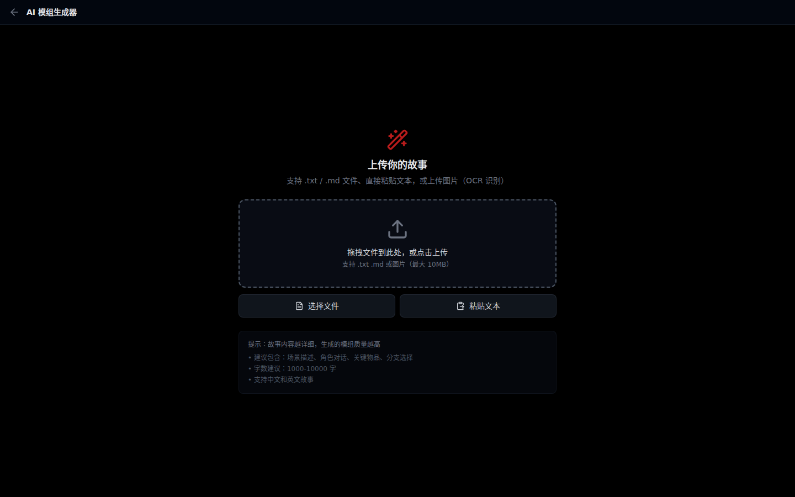

### 4. 开始游戏

1. 返回首页，点击「继续游戏」
2. 阅读对话，点击选项或输入自由指令推进剧情
3. 按 `ESC` 打开菜单进行存档/读档
4. 遇到战斗时选择行动，使用数字键 1-4 快速选择技能

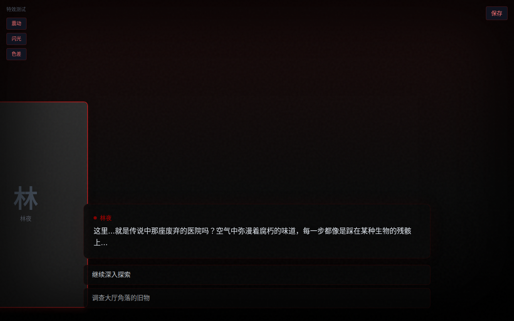

### 5. 使用 AI 生成新模组（可选）

1. 点击首页「上传故事，创建模组」
2. 粘贴你的故事文本（至少 200 字）
3. 选择规则系统（COC / D&D 5e / 自定义）
4. 点击「生成模组」，等待 AI 处理
5. 预览并保存到模组库

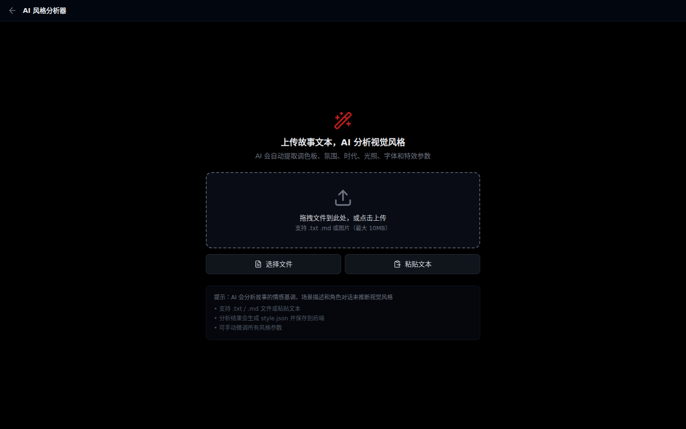

---

## 📸 截图展示

### 主界面

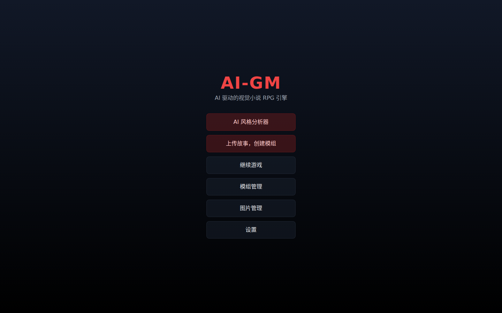

### 游戏界面

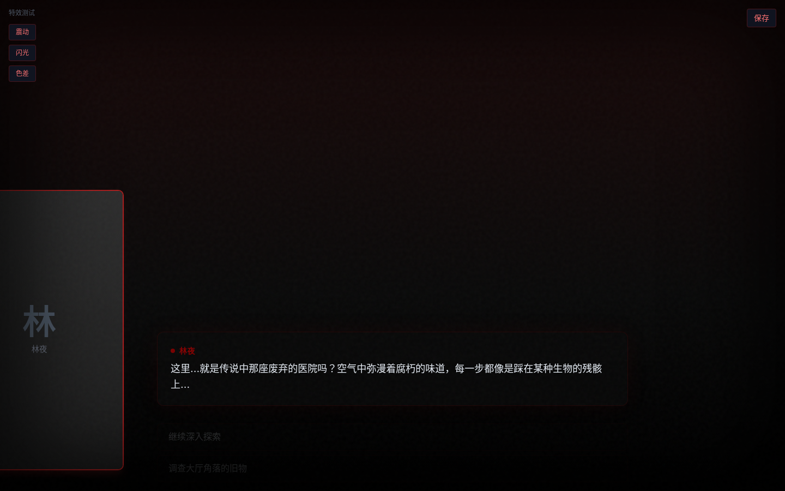

### 战斗界面

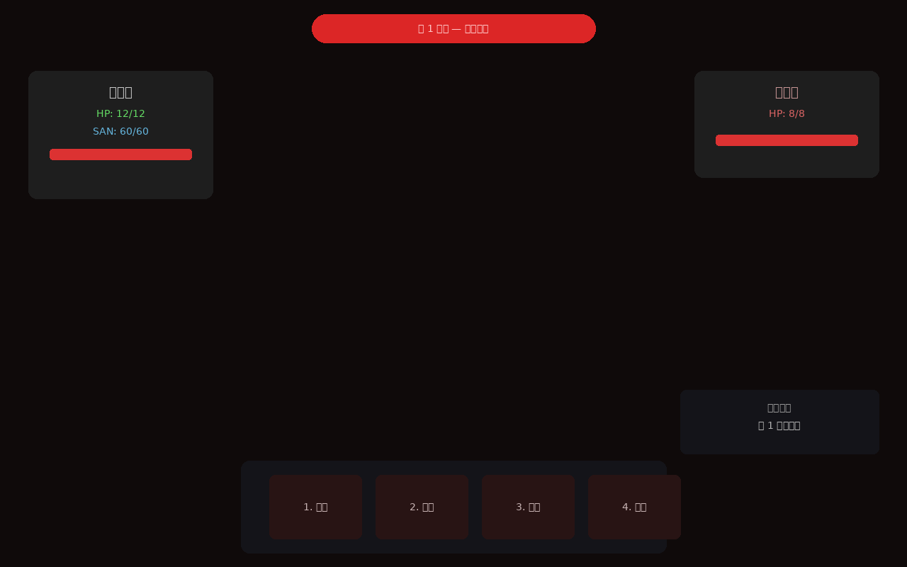

### 模组管理

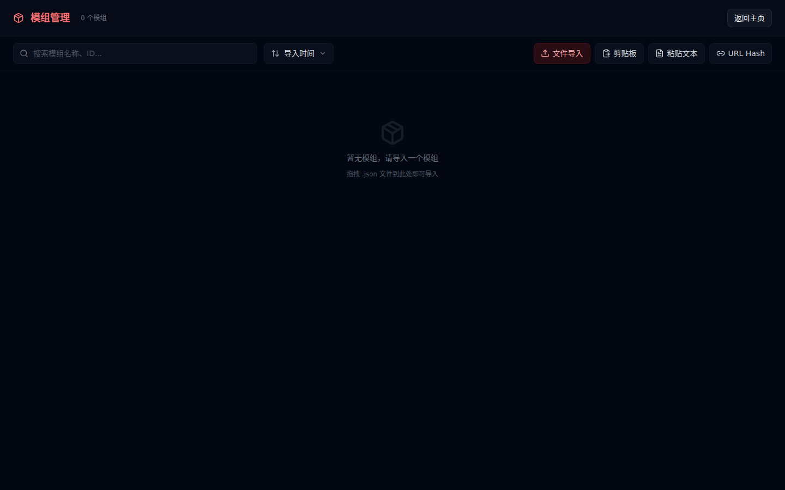

### 图片资源

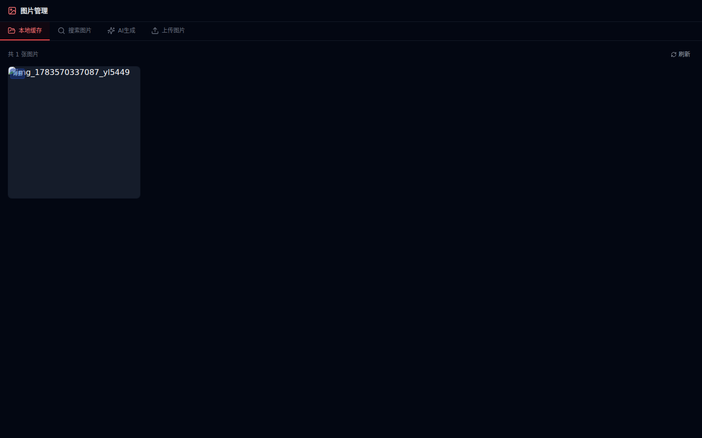

### 设置面板

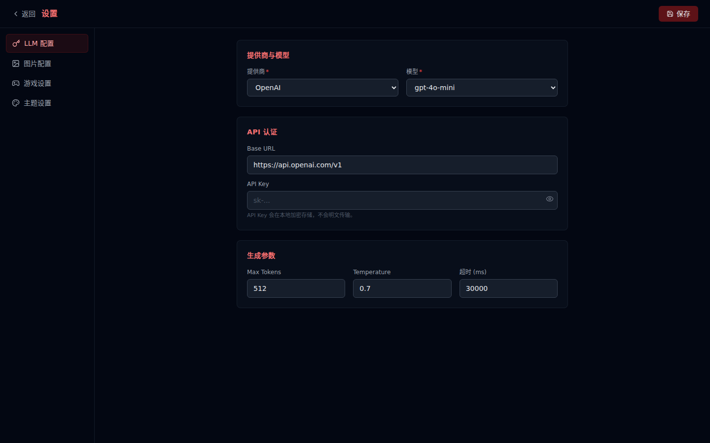

### 模组生成器


### 存档界面

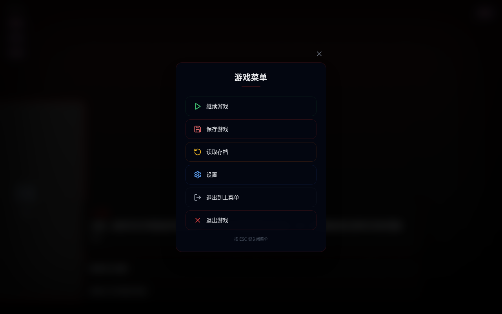

### 读档界面


---

## 📚 文档

| 文档 | 说明 | 链接 |
|------|------|------|
| **用户手册** | 安装、游玩、存档、设置、故障排除 | [docs/user-manual.md](docs/user-manual.md) |
| **开发者指南** | 架构、API、模组格式、扩展战斗技能 | [docs/developer-guide.md](docs/developer-guide.md) |
| **版本记录** | 变更日志与版本计划 | [docs/changelog.md](docs/changelog.md) |
| **架构设计** | 原始开发计划与架构图 | [docs/architecture.md](docs/architecture.md) |
| **Windows 构建指南** | Linux 交叉构建 Windows 安装包流程 | [docs/windows-build-guide.md](docs/windows-build-guide.md) |

---

## 🛠️ 技术栈与架构

### 技术栈

| 层级 | 技术 |
|------|------|
| 桌面壳 | Electron 33+ |
| 前端 | React 18 + Vite + TypeScript + Tailwind CSS |
| 状态管理 | Zustand（persist 中间件） |
| 动画 | Framer Motion |
| 后端 | Node.js + Express |
| 数据库 | SQLite (better-sqlite3) |
| 自动更新 | electron-updater |

### 架构概览

```
┌─────────────────────────────────────────────────────────────┐
│                    Electron Main Process                     │
│  ┌──────────────┐  ┌──────────────┐  ┌──────────────────┐   │
│  │  Main Window │  │ Backend Node │  │   Auto Updater   │   │
│  │  (Renderer)  │  │  (spawn)     │  │ (electron-       │   │
│  │              │  │  ELECTRON_   │  │  updater)        │   │
│  │  React +     │  │  RUN_AS_NODE │  │                  │   │
│  │  Vite Build  │  │  port 9742   │  │  GitHub Releases │   │
│  └──────┬───────┘  └──────┬───────┘  └──────────────────┘   │
│         │                 │                                  │
│         └─────────────────┘                                  │
│              Secure IPC (preload.cjs)                        │
│              contextIsolation: true                          │
└─────────────────────────────────────────────────────────────┘
                              │
┌─────────────────────────────────────────────────────────────┐
│                    Express Backend Server                    │
│  ┌──────────┐ ┌──────────┐ ┌──────────┐ ┌──────────────┐   │
│  │ /api/llm │ │ /api/    │ │ /api/    │ │  /api/images │   │
│  │   chat   │ │ modules  │ │  saves   │ │              │   │
│  │  stream  │ │          │ │          │ │              │   │
│  └────┬─────┘ └────┬─────┘ └────┬─────┘ └──────┬───────┘   │
│       └────────────┴────────────┴──────────────┘            │
│                         │                                   │
│              ┌──────────┴──────────┐                        │
│              │   SQLite Database   │                        │
│              │  (userData/aigm.db) │                        │
│              └─────────────────────┘                        │
└─────────────────────────────────────────────────────────────┘
```

### 核心模块架构

| 模块 | 文件 | 职责 |
|------|------|------|
| 游戏状态机 | `frontend/src/engine/state-machine.ts` | 场景流转、事件触发、条件判断、不可变状态更新 |
| 意图解析器 | `frontend/src/engine/intent-parser.ts` | NLP 解析玩家自由输入，识别行动类型和目标 |
| 故事引擎 | `frontend/src/engine/story-engine.ts` | 叙事生成、场景加载、剧情推进 |
| NPC 系统 | `frontend/src/engine/npc-system.ts` | NPC 状态管理、对话生成、好感度追踪 |
| NPC 决策 | `frontend/src/engine/npc-decision.ts` | 基于性格和上下文的自主决策逻辑 |
| 任务系统 | `frontend/src/engine/quest-system.ts` | 任务追踪、目标管理、完成判定 |
| 世界状态 | `frontend/src/engine/world-state.ts` | 全局变量、派系关系、场景事件 |
| 战斗系统 | `frontend/src/engine/combat-system.ts` | 回合制战斗、d100 检定、技能效果 |
| 情绪引擎 | `frontend/src/engine/emotion-engine.ts` | 角色情绪状态、情绪影响计算 |
| 探索系统 | `frontend/src/engine/explore-system.ts` | 环境调查、线索发现 |
| 规则引擎 | `frontend/src/engine/rule-engine.ts` | COC/D&D/自定义规则执行 |
| VN 引擎 | `frontend/src/components/engine/VisualNovelEngine.tsx` | 分层渲染、打字机动画、场景过渡 |
| 行动处理器 | `frontend/src/engine/action-handler.ts` | 统一处理玩家行动（点击选项/自由输入） |

---

## 🤝 贡献

欢迎提交 Issue 和 Pull Request！

- **Bug 报告**：请附上操作系统、应用版本、复现步骤和日志文件
- **功能建议**：在 Issue 中描述使用场景和期望行为
- **代码贡献**：参考 [开发者指南](docs/developer-guide.md#贡献指南)

---

## 📄 许可证

MIT License — 详见 [LICENSE.txt](LICENSE.txt) 文件。

---

## 🙏 致谢

- [Electron](https://www.electronjs.org/) — 跨平台桌面应用框架
- [React](https://react.dev/) — 前端 UI 框架
- [Vite](https://vitejs.dev/) — 前端构建工具
- [Tailwind CSS](https://tailwindcss.com/) — 实用优先 CSS 框架
- [Framer Motion](https://www.framer.com/motion/) — 动画库
- [better-sqlite3](https://github.com/WiseLibs/better-sqlite3) — 高性能 SQLite 驱动

---

> Made with ❤️ by AI-GM Project
> *Don't worry. Even if the world forgets, I'll remember for you.* 🖤
